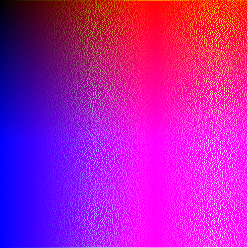
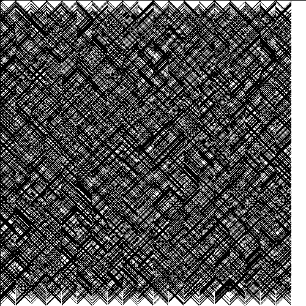
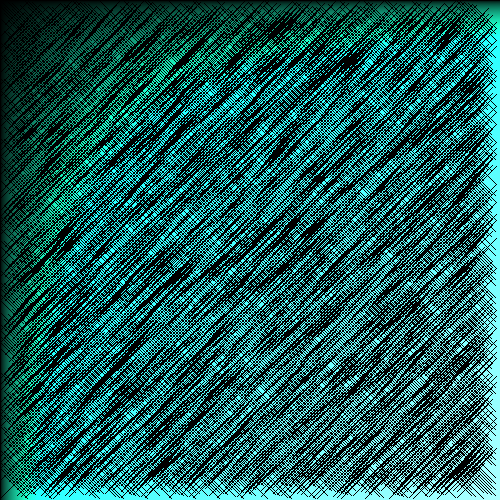

## Set of exercises from generativeartistry.com and my own sketches
|     |     |     |
| --- |:---:| ---:|
|  |  ||

### Currently present:
#### shaders
- apple loader
- cursor beam
- basic
#### rust sketches
- tiled lines(with simplified Bresenham algoritm implementation)

#### WIP:
- joy division (pulsar visualization)