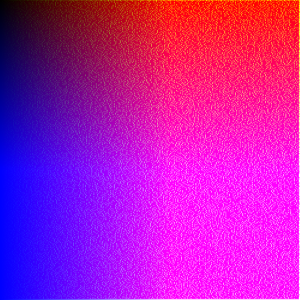

## Set of exercises from generativeartistry.com and my own sketches

### built with [nannou](https://github.com/nannou-org/nannou) and ❤️

### Currently I ported:
- tiled lines

TODO:
- flickering(some mouse dependent shiny octopus stuff)(my idea)